Issue 1: Pylance Errors on initial inspection
  Pylance Error 1
    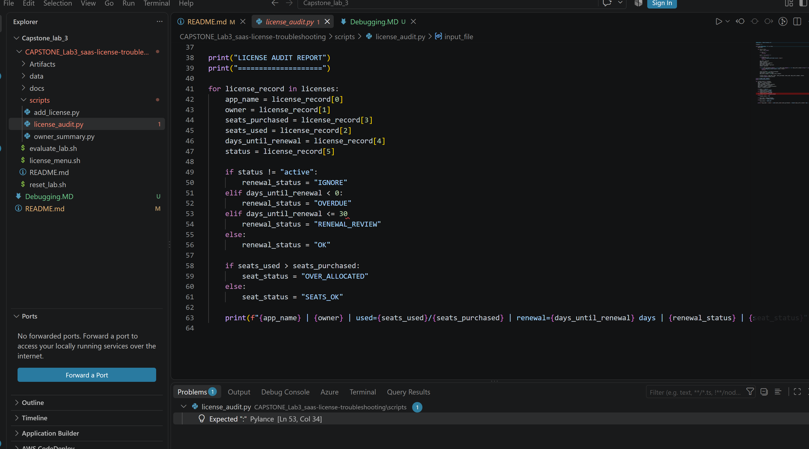
    Fix:
    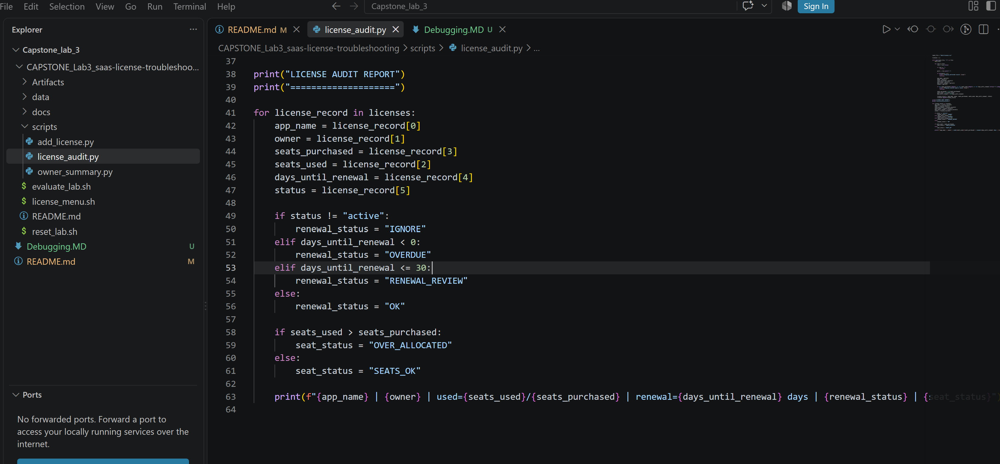

  Pylance Error 2
    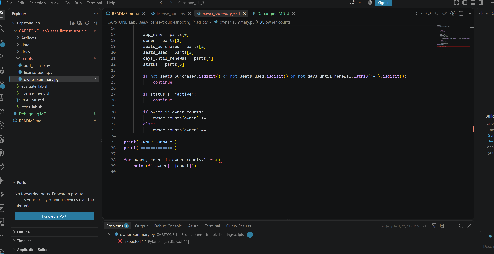
     Fix:
     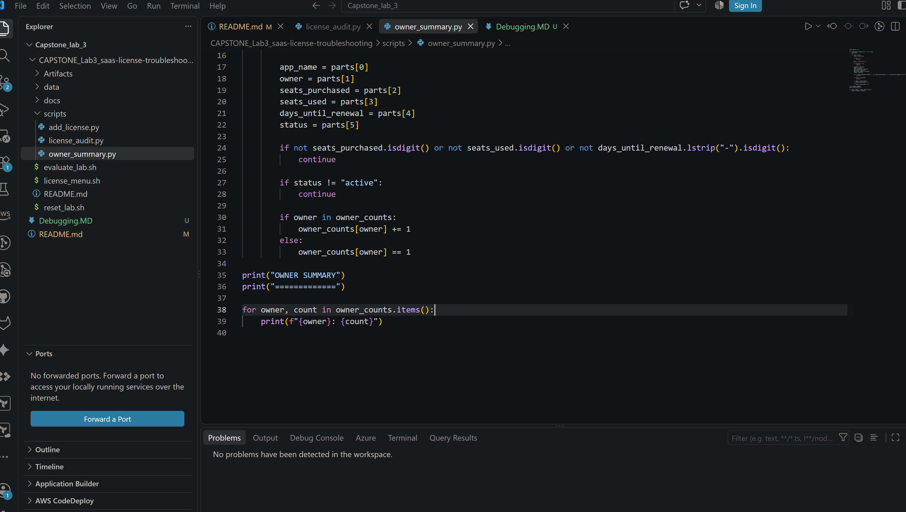

  Pylance Error 3
    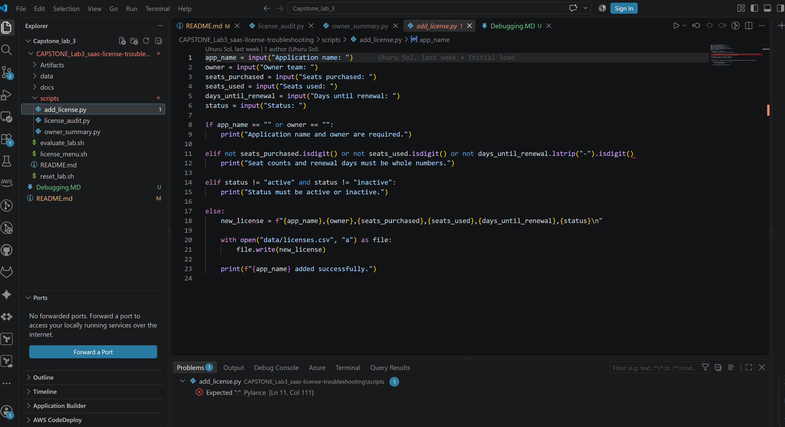
    Fix:
    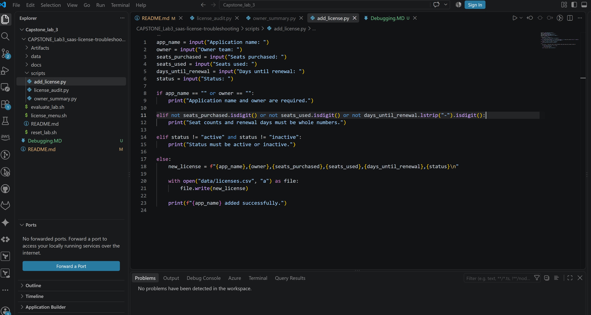
    
Issue 2: Liscensce Menu.sh returns invalid selection for all entries

   

   

 Check: Verify variable references for accuracy
    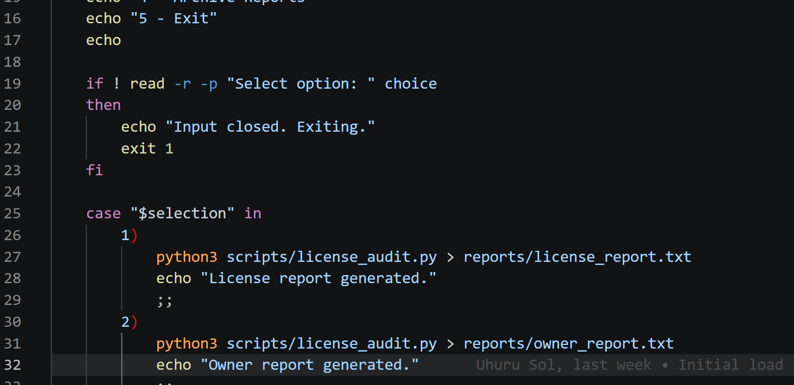

 Fix: Variable "$selection" is invalid. 
    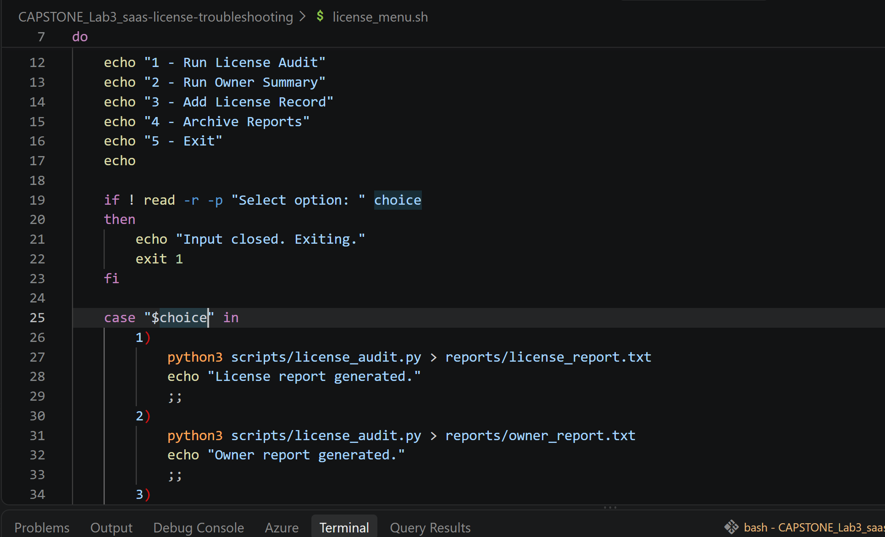

Issue 3:Python Execution Errors
    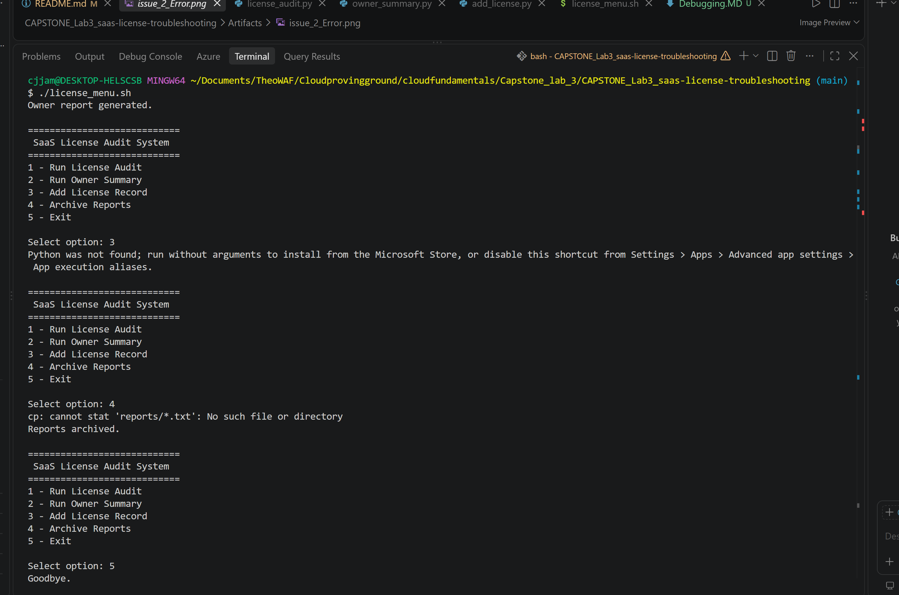

 Check: Try to Execute the individual Python Files. Fail
 Python3 execution is not working. Use PY "script_name.py" to execute
   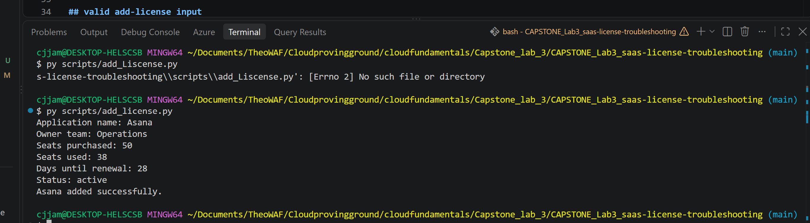

Issue 4: liscense_audit.py table display discrepancies. Seats used and seats purchased are inverted. As well as the function to check seats used/seats purchased

   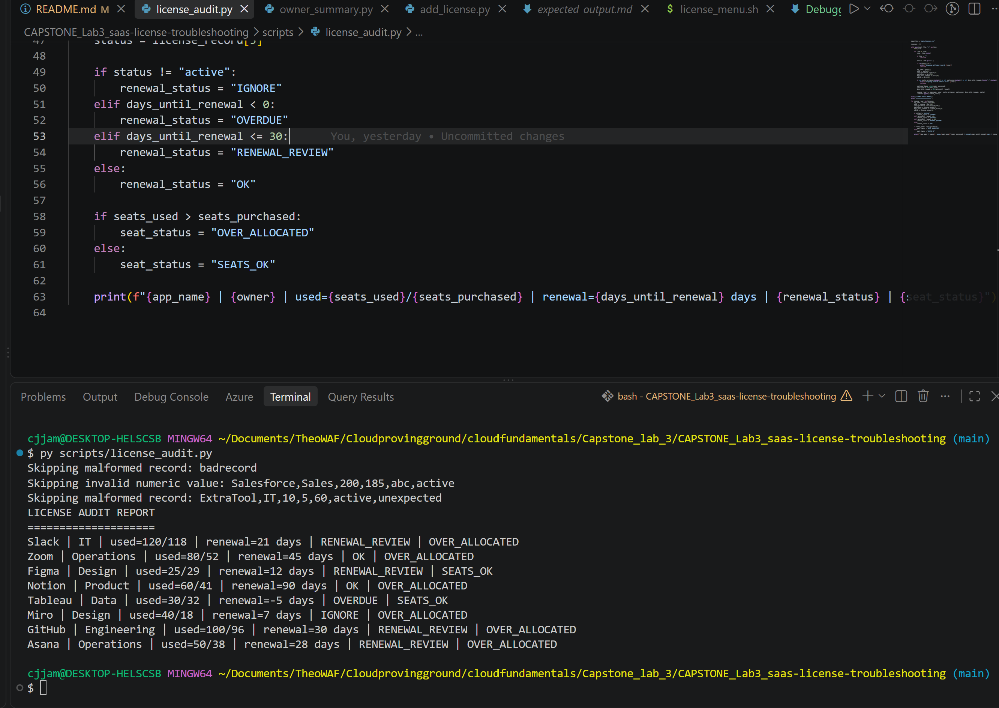

   Fixes: Changed line 58 to-" if seats_used < seats_purchased:"
   Changend line 63      "  | {owner} | used={seats_purchased}/{seats_used} |"

   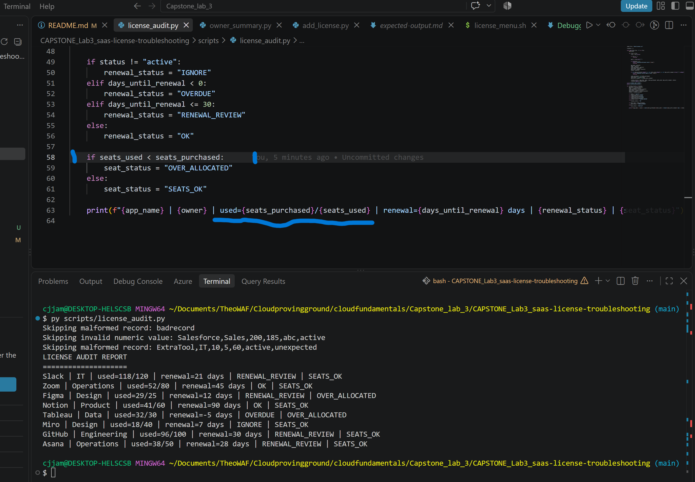

   Checks out against Expected output
   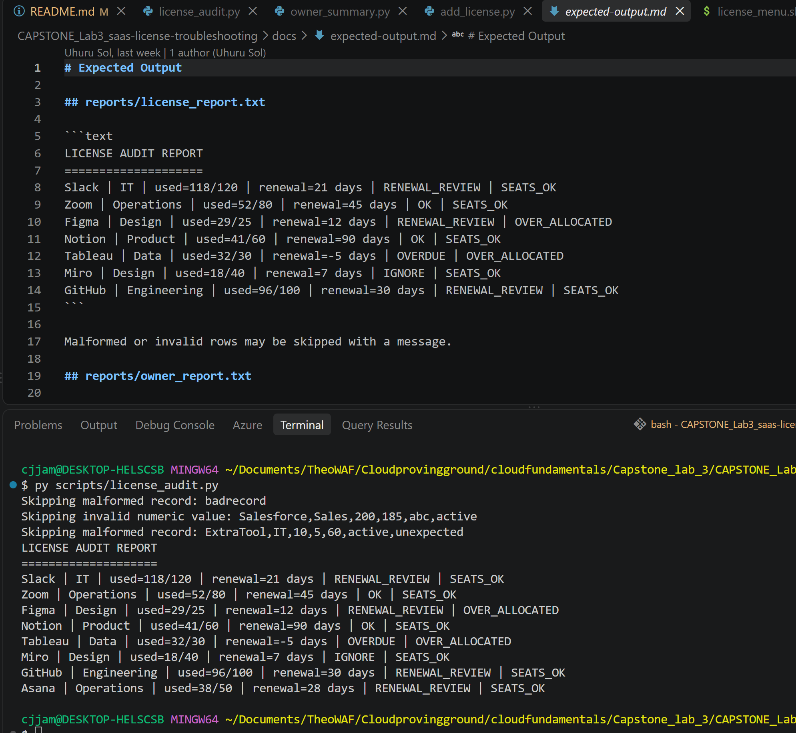

Issue 5: liscensce_menu.py failing to copy owner_summary.txt to archive.
  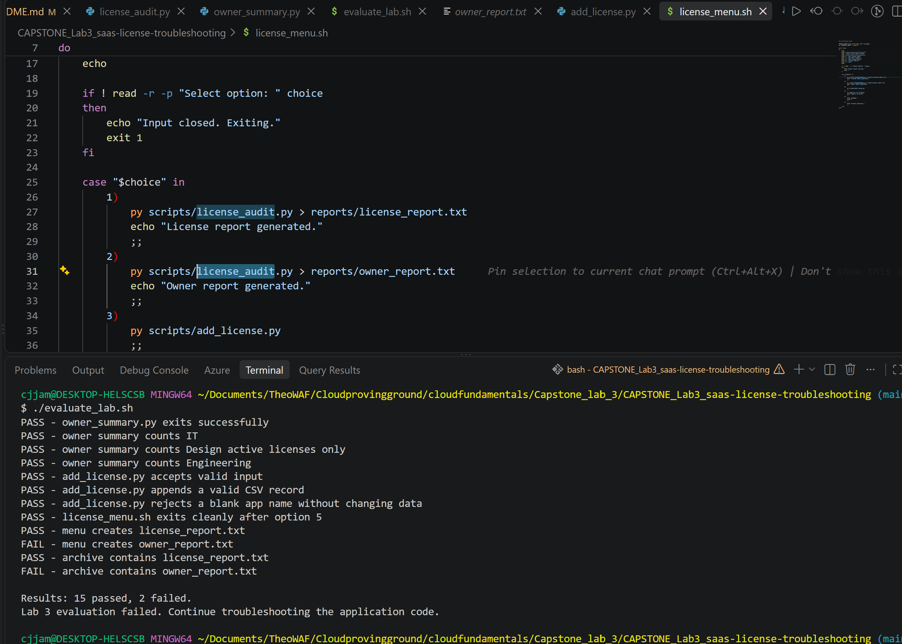

  Fix: Option 2 should be calling owner_summary.py

  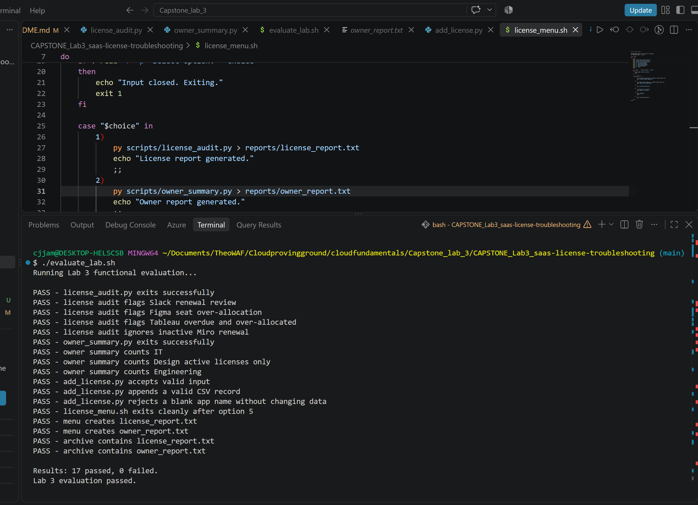

