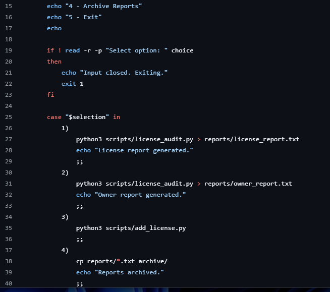

# Debugging Log 
### It walks the system and lists the chsnges
---
These are changes I made to ensure quality execution
Additionally, this is a log of bug fixes and / or logic structural changes made to run the application as requested.
The goal stated was NOT to rearchitect the solution, just get it up and running.

  
Change #1 - Pre and Post mkdir check

I added the mkdir -p check to ensure both directories that are referenced but not provisioned were actually
present to stop an error that hits without them being created.
I suppose you could consider it a logic error, the code works provided you actually have the spot to place files in.
  

  
For all the scripts calling python by using python3, that does not work on windows.  
I used py as a shortcut for python which does work on windows. the commasnd using python3 is for 
those who have macs.
 
Made a change to allow the menu choice option to actually be read and stored in the $choice, as selection 
is not a valid variable.

Change #2 - license_menu.sh makmenu option work successfully

---
## Reflection Questions

1. Which bugs were syntax errors?
    The bugs inthe .py files and the menu variable choice.

2. Which bugs were logic errors?
    The calls to scripts for directory paths not yet created.

3. Why should CSV input be validated before unpacking fields?
    You want to make certain that the data being entered is clean and will not break the input parameters

4. Why should automation tools skip bad records instead of crashing?
    If it is automated, you want to ensure a consistent pattern of behavior. If the code crashes, then there
    is no point  in automating a buggy system. It should be a repeatable process that at least writes down 
    the status of what took place in order to let the programmer know that certain things broke the 
    exexution process and we gracefully skipped it rather than break the system's flow.

5. Why is it useful to test Python files directly before testing the Bash menu?
    You want to verify that the individual programs actually execute instead of run by a hope and a prayer.

6. Why should the evaluator restore the original data after testing?
    To reset the cycle for a new tester to run to verify the same set of circumstances. Starting from a clean
    data set means that the test can be repeatable, differentiated only by the test data the new user puts in.